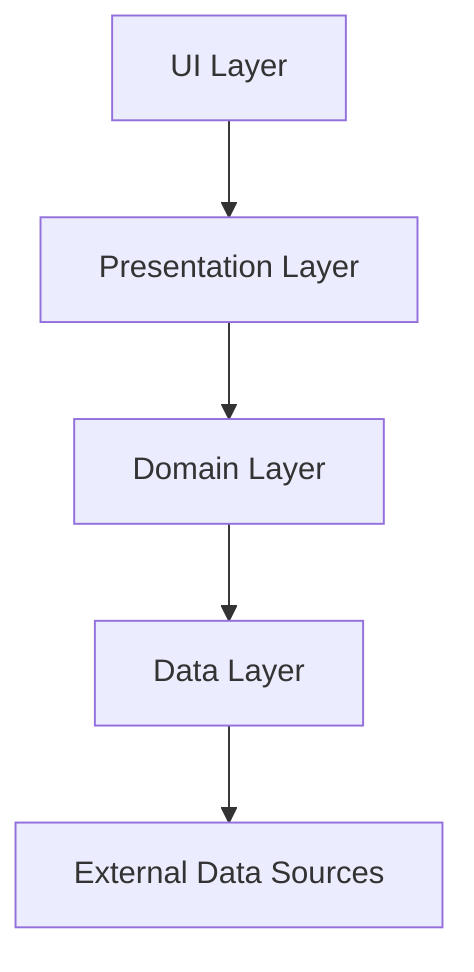

# MongoAI 프로젝트 📚✨

<div align="center">
  
  
</div>
<div align="center">
  <a href="https://gitflow-exercise.github.io/MongoAI-web/" target="_blank" style="
     display: inline-block;
     background-color: #6C63FF;
     color: white;
     padding: 10px 20px;
     margin-top: 10px;
     border-radius: 8px;
     text-decoration: none;
     font-weight: bold;
     box-shadow: 0 4px 6px rgba(0,0,0,0.1);
     transition: background-color 0.3s ease;
  " onmouseover="this.style.backgroundColor='#2bb67c'" onmouseout="this.style.backgroundColor='#3ECF8E'">
    Mongo AI 바로가기 🚀
  </a>
</div>

## 프로젝트 소개 🚀

기업 프로젝트 일환으로 MongoAI는 교사를 위한 AI 기반 문제집 생성 도구입니다. 교사들이 텍스트, 이미지, PDF에서 문제를 자동으로 생성하고, 맞춤형 문제집을 즉시 제작할 수 있도록 도와줍니다. 팀 협업 기능을 통해 교사들이 문제집을 공유하고 함께 작업할 수 있습니다.

### 왜 MongoAI인가요? 🤔

교사들은 평균적으로 주당 10-15시간을 교육 자료 준비에 사용합니다. MongoAI는 이 시간을 획기적으로 단축시켜 교사들이 학생 지도에 더 집중할 수 있도록 합니다. 단 몇 분 만에 다양한 유형의 문제를 생성하고 커스터마이징할 수 있습니다.

## 주요 기능 ✨

- **AI 기반 문제 생성** - 텍스트, 이미지, PDF에서 자동으로 문제 생성
- **맞춤형 PDF 문제집** - 즉시 다운로드 가능한 문제집 제작
- **팀 협업 시스템** - 팀원들과 문제집 공유 및 공동 작업
- **폴더 관리** - 체계적인 문제집 분류 및 관리
- **북마크 기능** - 중요한 문제집 표시 및 빠른 접근
- **휴지통 기능** - 삭제된 문제집 복원 가능. Supabase crob job 활용

## 개발 팀 소개 👨‍💻👩‍💻

| 팀원   | 역할                      | github profile                              |
| ------ | ------------------------- | ------------------------------------------- |
| 김옥현 | 사용자 인증, 디자인, 기획 | [okstring](https://github.com/okstring)     |
| 임명우 | (추가, 수정 예정)         | [Dansot4891](https://github.com/Dansot4891) |
| 최지민 | 대시보드(폴더, 휴지통, 드래그), SQL DB설계  | [irmu98](https://github.com/irmu98)         |
| 허준호 | 문제집 생성(순서 배치, 수정, 저장), 결제 | [helljh](https://github.com/helljh)         |


## 기술 스택 🛠️

### 프론트엔드

- **Riverpod**: 상태 관리
- **Go_Router**: 라우팅
- **Freezed**: 불변 객체 생성

### 백엔드

- **Supabase**: 서버리스 백엔드 플랫폼
  - Auth: 사용자 인증
  - PostgreSQL: 데이터베이스
  - Storage: 파일 저장
  - Edge Functions: 서버리스 함수
- **Firebase**: Google Analytics 

### 개발 도구

- **Git & GitHub**: 버전 관리 및 협업

- **GitHub Actions**: CI/CD

- **Figma**: UI/UX 디자인 - [Figma 디자인 바로가기](https://www.figma.com/design/XqEZ6dBUOKMbyUnnLNENFP/Mongo-AI-%EC%9E%90%EC%B2%B4-%EB%94%94%EC%9E%90%EC%9D%B8?node-id=0-1&t=5eBEk9YAAfiydj2h-1)

## 아키텍처 🏗️

MongoAI는 MVI + MVVM, Clean Architecture 패턴을 사용합니다. 이를 통해 확장성, 테스트 용이성, 코드 품질을 보장합니다.

```
lib/
├── core/                 # 공통 기능 및 유틸리티
│   ├── component/        # 재사용 가능한 UI 컴포넌트
│   ├── constants/        # 앱 전체에서 사용되는 상수
│   ├── di/               # 의존성 주입
│   ├── enum/             # 열거형 정의
│   ├── extension/        # 확장 메서드
│   ├── result/           # 결과 처리 래퍼
│   ├── event/            # 전역 이벤트 처리
│   ├── routing/          # 라우팅 설정
│   ├── state/            # 전역 상태 관리
│   ├── style/            # 스타일 정의
│   └── utils/            # 유틸리티 함수
├── auth/                 # 인증 관련 기능
│   ├── data/             # 데이터 레이어
│   ├── domain/           # 도메인 레이어
│   └── presentation/     # 프레젠테이션 레이어
├── dashboard/            # 대시보드 기능
...
├── create/               # 문제 생성 기능
...
└── landing/              # 랜딩 페이지 및 마케팅
...
```

### Clean Architecture



### MVI 패턴 구성요소

- **State**: 화면 상태 정의 (불변 객체)
- **Action**: 사용자 액션 정의 (sealed class)
- **Event**: 일회성 이벤트 정의 (스낵바, 다이얼로그 등)
- **ViewModel**: 상태 관리 및 비즈니스 로직 처리
- **Screen**: UI 구성 요소 및 레이아웃
- **ScreenRoot**: 화면 진입점, ViewModel 연결 및 이벤트, 액션 처리

## 코드 컨벤션 📐

### 스타일 규칙

- **const Lint**: const 선언을 최대한 활용하여 메모리 성능 최적화
- **위젯 분리**: 기능적인 로직을 단순 메소드가 아닌 위젯 단위로 분리하여 재사용성과 가독성 향상
- **하드코딩 방지**: 색상 및 텍스트 스타일은 `AppColor`, `AppTextStyle` 상수 사용

## 개발 프로세스 🔄

MongoAI 팀은 애자일 방법론을 따르며, 다음과 같은 개발 프로세스를 사용합니다:

1. **이슈 생성**: 새로운 기능, 버그 수정 등을 GitHub 이슈로 등록
2. **브랜치 생성**: 해당 이슈에 맞는 브랜치 생성 (네이밍 규칙 준수)
3. **개발 작업**: 코드 작성 및 테스트 수행
4. **PR 생성**: 작업 완료 후 Pull Request 생성 및 이슈 연결
5. **코드 리뷰**: 최소 1명 이상의 팀원이 코드를 리뷰하고 승인
6. **Merge**: 코드 리뷰 통과 후 develop 브랜치에 병합
7. **배포**: main 브랜치에 Push시 CI/CD 파이프라인을 통한 자동 배포

## 브랜치 전략 🌿

Git Flow 전략을 기반으로 한 브랜치 전략을 사용합니다:

- `main`: 제품 릴리스 버전, 항상 안정적인 상태 유지
- `develop`: 개발 중인 코드의 통합 브랜치
- `feature/<feature-name>`: 새로운 기능 개발
- `fix/<issue-number>`: 버그 수정
- `hotfix/<issue-number>`: 긴급 버그 수정
- `chore/<task-name>`: 빌드 스크립트, 환경 설정 등 기타 작업
- `docs/<document-name>`: 문서 추가 또는 수정
- `style/<component-name>`: UI 스타일 변경 작업


## 팀 문화 👥

MongoAI 팀은 다음과 같은 문화를 가지고 있습니다:

- **데일리 스크럼**: 매일 평일 업무시작 전 회고, 현재상황 공유를 통해 추후 개선점 도출
- **페어 프로그래밍**: 복잡한 기능 개발 시 페어 프로그래밍 활용
- **코드 리뷰 문화**: 모든 코드는 최소 1명 이상의 리뷰를 받음


## 프로젝트 마일스톤 🏁

- **1주차(2025. 05. 02~ 2025. 05. 12)**: 기업 프로젝트 차 미팅, 자체 기획 확정, 자체 디자인, 아키텍처 설계 및 기술 조사
- **2주차(2025. 05. 13~ 2025. 05. 19)**: 디자인, 기획에 맞춰 개발 착수
- **3주차(2025. 05. 20~ 2025. 05. 26)**: 추가 기능 구현, 리팩토링 및 시연 영상, 발표 준비
- **2025. 05. 27**: 최종 발표

------

<div align="center">   <p><i>MongoAI - 교사의 시간을 절약하고, 교육의 질을 높이는 AI 동반자</i></p>   <p>Made with ❤️ by the MongoAI Team</p> </div>
